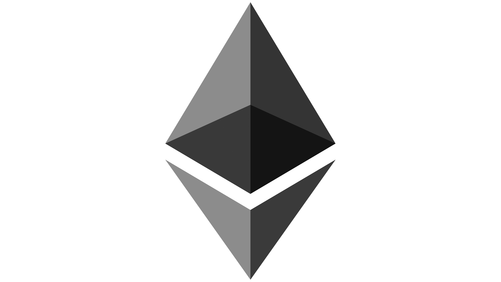

# 🚀 GasZero - Gasless Transaction Platform

<div align="center">



**Execute blockchain transactions without paying gas fees**

[Features](#-features) • [Quick Start](#-quick-start) • [How It Works](#-how-it-works) • [Documentation](#-documentation)

</div>

---

## 📖 Overview

**GasZero** is a gasless transaction platform that enables users to execute blockchain transactions without holding native tokens (ETH) for gas fees. Using a relayer-based architecture, GasZero pays gas fees on behalf of users while deducting a small service fee from their token transfers or swaps.

### 🎯 Key Use Cases

- **GasZero Transfer**: Send USDC/USDT without ETH for gas
- **GasZero Swap**: Swap tokens via Uniswap V3 without ETH
- **GasZero Bridge**: (WIP) Cross-chain bridging without gas fees

---

## ✨ Features

### 🔥 Core Features

- **Zero Gas Required**: Users don't need native tokens (ETH) to execute transactions
- **Multi-Chain Support**: Ethereum Sepolia, Arbitrum Sepolia, Base Sepolia
- **Token Transfers**: Gasless ERC-20 token transfers with signature-based authorization
- **Token Swaps**: Gasless DEX swaps via Uniswap V3
- **Relayer Network**: Decentralized relayer system handles gas payments
- **Signature-Based Auth**: Secure transactions using wallet signatures
- **Auto-Approval Management**: Intelligent approval handling for seamless UX
- **Real-time Fee Calculation**: Transparent 2% service fee + gas cost estimation

### 🎨 Frontend Features

- **Rainbow Kit Integration**: Easy wallet connection
- **Multi-Chain Selector**: Switch between supported networks
- **Token Balance Display**: Real-time balance updates
- **Transaction Status**: Live feedback with toast notifications
- **Responsive Design**: Modern UI with Tailwind CSS
- **Dark Mode**: Sleek dark interface

---

## 🛠️ Tech Stack

### Frontend
- **Next.js 15** - React framework with App Router
- **React 19** - UI library
- **TypeScript** - Type safety
- **Tailwind CSS 4** - Styling
- **RainbowKit** - Wallet connection
- **Wagmi & Viem** - Ethereum interactions
- **React Hot Toast** - Notifications

### Backend
- **Next.js API Routes** - Serverless API endpoints
- **Viem** - Ethereum library
- **Ethers v5** - Legacy support

### Smart Contracts
- **Uniswap V3** - DEX protocol
- **ERC-20 Tokens** - USDC, USDT

### Infrastructure
- **Public RPC Nodes** - Sepolia, Arbitrum Sepolia, Base Sepolia
- **Relayer Wallets** - Funded EOA accounts for gas payment

---

## 🏗️ How It Works

### Architecture Overview

```
┌─────────────┐         ┌──────────────┐         ┌─────────────┐
│    User     │────────▶│   Frontend   │────────▶│  Relayer    │
│   Wallet    │  Sign   │  (Next.js)   │  API    │  Service    │
└─────────────┘         └──────────────┘         └─────────────┘
                               │                        │
                               │                        ▼
                               │                  ┌─────────────┐
                               └─────────────────▶│ Blockchain  │
                                    Monitor       │  (Sepolia)  │
                                                  └─────────────┘
```

### Transaction Flow

#### 1️⃣ **GasZero Transfer**
```
1. User signs transfer request (off-chain)
2. Frontend sends signature + transfer details to API
3. Relayer verifies signature
4. Relayer pulls tokens from user (user must approve relayer first)
5. Relayer deducts service fee (2%)
6. Relayer transfers remaining tokens to recipient
7. Gas paid by relayer
```

#### 2️⃣ **GasZero Swap**
```
1. User signs swap request (off-chain)
2. Frontend sends signature + swap details to API
3. Relayer verifies signature
4. Relayer pulls tokens from user (user must approve relayer first)
5. Relayer deducts service fee (2%)
6. Relayer approves Uniswap Router to spend tokens
7. Relayer executes swap via Uniswap V3
8. Swap output sent directly to user's wallet
9. Gas paid by relayer
```

### Key Concepts

- **Signature Verification**: Uses EIP-191 message signing for authentication
- **Token Approval**: Users approve relayer once, relayer approves router for swaps
- **Nonce Tracking**: Prevents replay attacks
- **Fee Structure**: 2% service fee + gas cost covered by relayer
- **Fee Tiers**: Uniswap V3 pools with optimal fee tier selection (0.05% - 1%)

---

## 🚀 Quick Start

### Prerequisites

- **Node.js** 18+ and npm
- **Wallet** (MetaMask, Rainbow, etc.)
- **Testnet ETH** (for initial relayer funding)
- **Testnet Tokens** (USDC/USDT on Sepolia)

### Installation

```bash
# Clone the repository
git clone <repository-url>
cd OneTap

# Install dependencies
npm install

# Set up environment variables
cp .env.example .env.local

# Edit .env.local with your configuration
nano .env.local
```

### Environment Variables

Create a `.env.local` file with the following:

```env
# RPC Endpoints
NEXT_PUBLIC_SEPOLIA_RPC_URL=https://ethereum-sepolia-rpc.publicnode.com
NEXT_PUBLIC_ARB_SEPOLIA_RPC_URL=https://sepolia-rollup.arbitrum.io/rpc
NEXT_PUBLIC_BASE_SEPOLIA_RPC_URL=https://sepolia.base.org

# Relayer Private Keys (EOA wallets with ETH for gas)
RELAYER_PRIVATE_KEY_ETH_SEPOLIA=0x...
RELAYER_PRIVATE_KEY_ARB_SEPOLIA=0x...
RELAYER_PRIVATE_KEY_BASE_SEPOLIA=0x...

# Optional: Custom RPC for higher rate limits
ALCHEMY_API_KEY=your_alchemy_key
INFURA_PROJECT_ID=your_infura_id
```

### Setup Relayers

```bash
# Generate relayer wallets (if you don't have them)
node scripts/generate-wallets.js

# Setup and fund relayers
npm run setup

# Check relayer balances and configuration
npm run check
```

### Run Development Server

```bash
npm run dev
```

Open [http://localhost:3000](http://localhost:3000) in your browser.

---

## 📋 Configuration

### Relayer Addresses

Configured in `src/config/relayers.json`:

```json
{
  "relayerAddresses": {
    "eth-sepolia": "0x77d4C017fAA44Ff6f96e2877b45Befd233D0ef65",
    "arb-sepolia": "0x77d4C017fAA44Ff6f96e2877b45Befd233D0ef65",
    "base-sepolia": "0x7337d8b9E84B0C9f88316439AfFaE9eE99b6C3C1"
  }
}
```

### Supported Tokens

Configured in `src/config/chain.config.ts`:

| Chain | Token | Address |
|-------|-------|---------|
| Ethereum Sepolia | USDC | `0x1c7D4B196Cb0C7B01d743Fbc6116a902379C7238` |
| Ethereum Sepolia | USDT | `0x7169D38820dfd117C3FA1f22a697dBA58d90BA06` |
| Ethereum Sepolia | WETH | `0xfFf9976782d46CC05630D1f6eBAb18b2324d6B14` |
| Arbitrum Sepolia | USDC | `0x75faf114eafb1BDbe2F0316DF893fd58CE46AA4d` |
| Base Sepolia | USDC | `0x036CbD53842c5426634e7929541eC2318f3dCF7e` |

### Uniswap V3 Contracts

| Chain | Contract | Address |
|-------|----------|---------|
| Ethereum Sepolia | SwapRouter | `0x3bFA4769FB09eefC5a80d6E87c3B9C650f7Ae48E` |
| Ethereum Sepolia | Quoter | `0xEd1f6473345F45b75F8179591dd5bA1888cf2FB3` |
| Arbitrum Sepolia | SwapRouter | `0x101F443B4d1b059569D643917553c771E1b9663E` |
| Base Sepolia | SwapRouter | `0x94cC0AaC535CCDB3C01d6787D6413C739ae12bc4` |

---

## 🎮 Usage

### 1. Connect Wallet

Click "Connect Wallet" and select your preferred wallet (MetaMask, Rainbow, WalletConnect, etc.).

### 2. GasZero Transfer

1. Navigate to "GasZero Transfer" tab
2. Select chain (Ethereum, Arbitrum, or Base Sepolia)
3. Select token (USDC or USDT)
4. Enter recipient address
5. Enter amount to send
6. If first time: Approve relayer to spend tokens
7. Click "Send with Zero Gas"
8. Sign the message in your wallet
9. Wait for transaction confirmation

**Note**: You only pay a 2% service fee from your token balance. No ETH needed!

### 3. GasZero Swap

1. Navigate to "GasZero Swap" tab
2. Select chain
3. Select tokens to swap (From → To)
4. Enter amount
5. Review expected output and fees
6. If first time: Approve relayer to spend tokens
7. Click "Execute Gasless Swap"
8. Sign the message in your wallet
9. Wait for swap confirmation

**Supported Swap Pairs**:
- USDC ↔ ETH (WETH)
- USDT ↔ ETH (WETH)
- USDC ↔ USDT

### 4. GasZero Bridge (WIP)

Coming soon! Cross-chain token bridging without gas fees.

---

## 📡 API Endpoints

### POST `/api/relay`

Execute a gasless transfer or swap.

**Request Body**:
```json
{
  "type": "transfer" | "swap",
  "chain": "eth-sepolia" | "arb-sepolia" | "base-sepolia",
  "fromAddress": "0x...",
  "signature": "0x...",
  "nonce": 1234567890,

  // For transfer
  "toAddress": "0x...",
  "token": "USDC" | "USDT",
  "amount": "100",

  // For swap
  "fromToken": "USDC",
  "toToken": "ETH",
  "amountIn": "100",
  "minAmountOut": "0.00001",
  "feeTier": 3000
}
```

**Response**:
```json
{
  "success": true,
  "hash": "0x...",
  "fee": "0.5"
}
```

### POST `/api/fund-user-eth`

Emergency ETH funding endpoint (testnet only).

**Request Body**:
```json
{
  "address": "0x...",
  "chain": "eth-sepolia"
}
```

---

## 🧪 Scripts

### Setup Scripts

```bash
# Setup relayers (fund and verify)
npm run setup

# Check relayer balances and configuration
npm run check

# Check testnet token balances
node scripts/check-testnet-balance.js

# Generate new relayer wallets
node scripts/generate-wallets.js
```

---

## 📁 Project Structure

```
OneTap/
├── public/                    # Static assets (logos, images)
│   ├── eth.png
│   ├── ARB.jpg
│   └── base.png
├── scripts/                   # Setup and utility scripts
│   ├── setup-relayers.js
│   ├── check-setup.js
│   └── generate-wallets.js
├── src/
│   ├── app/                   # Next.js app directory
│   │   ├── api/              # API routes
│   │   │   ├── relay/        # Main relay endpoint
│   │   │   └── fund-user-eth/ # ETH funding endpoint
│   │   ├── page.tsx          # Landing page
│   │   ├── gaszero/          # Transfer page
│   │   ├── swap/             # Swap page
│   │   ├── bridge/           # Bridge page (WIP)
│   │   ├── layout.tsx        # Root layout
│   │   └── providers.tsx     # Web3 providers
│   ├── config/               # Configuration files
│   │   ├── chain.config.ts   # Chain and token configs
│   │   └── relayers.json     # Relayer addresses
│   └── lib/                  # Core logic
│       ├── relayer-service.ts # Relayer transaction handling
│       ├── expand-api.ts      # DEX aggregation (future)
│       └── abis/             # Contract ABIs
├── package.json
├── tsconfig.json
├── tailwind.config.js
└── README.md
```

---

## 🔧 Development


### Building for Production

```bash
npm run build
npm run start
```

### Code Style

- **TypeScript**: Strict mode enabled
- **Linting**: ESLint with Next.js config
- **Formatting**: Prettier (recommended)

---

## 🐛 Troubleshooting

### Common Issues

#### 1. "Insufficient allowance" Error
**Solution**: User needs to approve the relayer first. Click "Approve Relayer" button.

#### 2. "Swap transaction reverted"
**Possible causes**:
- Insufficient liquidity in Uniswap pool
- Wrong fee tier
- Slippage too high (increase minAmountOut)
- Token address mismatch

**Solution**: Check fee tier (usually 3000 for USDC/ETH), verify token addresses.

#### 3. "Rate limit exceeded" or "In-flight transaction limit"
**Cause**: Too many requests to public RPC node.

**Solution**:
- Add delays between transactions
- Use private RPC endpoint (Alchemy/Infura)
- Upgrade RPC plan

#### 4. Relayer has no ETH
**Solution**: Fund relayer with testnet ETH:
```bash
npm run setup
```

#### 5. Transaction stuck/pending
**Solution**: Wait for confirmation or check on block explorer:
- Ethereum Sepolia: https://sepolia.etherscan.io
- Arbitrum Sepolia: https://sepolia.arbiscan.io
- Base Sepolia: https://sepolia.basescan.org

---

## 🌐 Supported Networks

| Network | Chain ID | RPC Endpoint | Block Explorer |
|---------|----------|--------------|----------------|
| Ethereum Sepolia | 11155111 | https://ethereum-sepolia-rpc.publicnode.com | https://sepolia.etherscan.io |
| Arbitrum Sepolia | 421614 | https://sepolia-rollup.arbitrum.io/rpc | https://sepolia.arbiscan.io |
| Base Sepolia | 84532 | https://sepolia.base.org | https://sepolia.basescan.org |

---

## 🛣️ Roadmap

- [x] Gasless token transfers
- [x] Gasless Uniswap V3 swaps
- [x] Multi-chain support (3 testnets)
- [x] Auto-approval management
- [ ] Cross-chain gasless bridge
- [ ] DEX aggregation (1inch, 0x)
- [ ] AI Solvers
- [ ] Mainnet deployment
- [ ] Relayer incentive mechanism
- [ ] Decentralized relayer network
- [ ] Gas price optimization
- [ ] Batch transactions
- [ ] NFT transfers

---

## 📄 License

This project is open source and available under the [MIT License](LICENSE).

---

## 🤝 Contributing

Contributions are welcome! Please feel free to submit a Pull Request.

---

## 📞 Support

For questions or issues:
- Open an issue on GitHub
- Contact the team

---

## 🎯 Key Highlights

- ⚡ **Zero Gas**: No ETH required for transactions
- 🔒 **Secure**: Signature-based authorization
- 🌐 **Multi-Chain**: Ethereum, Arbitrum, Base
- 💱 **DEX Integration**: Uniswap V3 swaps
- 🎨 **Modern UI**: Beautiful, responsive interface
- 🚀 **Fast**: Optimized transaction flow
- 💰 **Low Fees**: Only 2% service fee

---

<div align="center">

**Built with ❤️ by the GasZero Team**

⚡ Making blockchain transactions accessible to everyone ⚡

</div>
